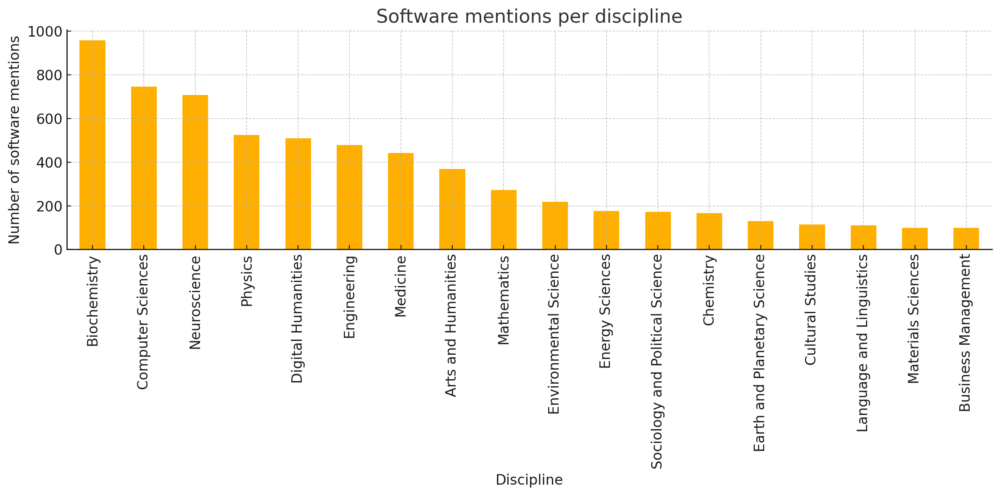

# Dataset
| Resource Type | Link |
| :--- | :--- |
| 📄 **Documentation** | [Starting environment for human
annotation of software mentions](https://sofair.org/wp-content/uploads/2024/04/D4.1-Starting-environment-for-human-annotation-of-software-mentions.pdf) |
| 📄 **Dataset** | [Dataset](https://github.com/SoFairOA/Dataset) |
| 📄 **Paper** | [Paper](https://doi.org/10.21954/ou.rd.30374830) |

This multidisciplinary dataset, developed by the SoFAIR project with CLARIN-PL, contains over 9,000 manually annotated software mentions and 2,000 relationships across nearly 500 research papers from 18 scientific disciplines. It is available in TEI XML format under a CC-BY license and is useful for evaluating language models and developing software extraction tools.

The dataset is available at [https://github.com/SoFairOA/Dataset](https://github.com/SoFairOA/Dataset).

## Statistics

## Compatibility with SoftCite dataset
Our goal was to create a gold standard manually annotated dataset with a wider coverage of domains than the existing [SoftCite](https://github.com/softcite/softcite_dataset_v2) dataset (limited to Economy and Biochemistry). We follow the same [annotation guidelines](https://github.com/softcite/softcite_dataset_v2/blob/master/annotation_guidelines_tei_xml.md) as the SoftCite dataset, and thus it can complement the original data.
