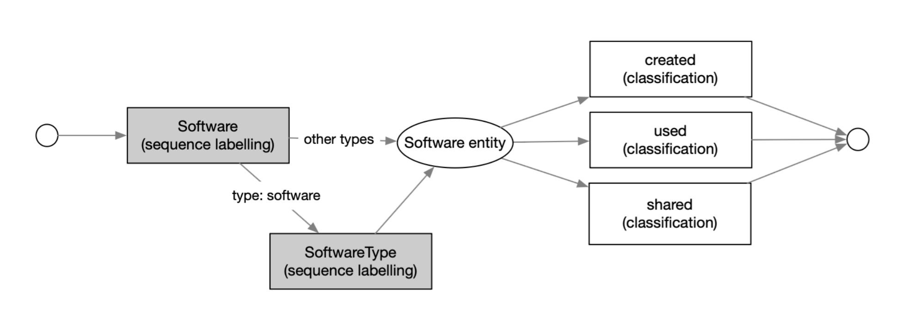
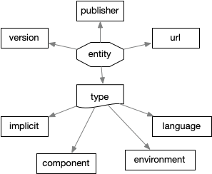
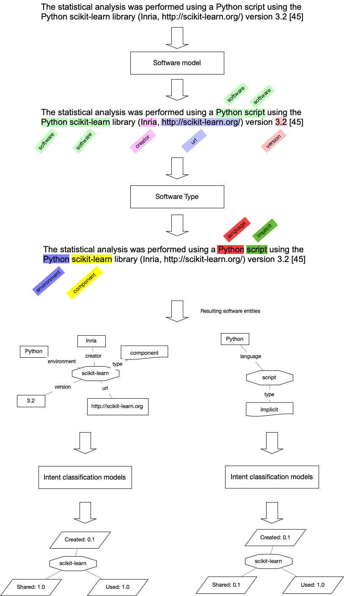

# Software Mention Extraction and Disambiguation

## Introduction

The system for software mention detection is built as a **cascade of models**, where each model builds on the output of the previous one to extract structured information from text. At a high level, the architecture begins with **sequence labelling models** that identify basic software-related spans in the text, followed by **specialised extractors** that assign deeper semantic roles or types to each identified mention.

Figure 1 illustrates this pipeline, where the first stage detects mentions of software and related metadata, and the second stage focuses on characterising these mentions by their functional type.

***Figure 1**: Software-mentions models cascade, with emphasis of the models software and softwareType that are the object of this document. In grey the models that are discussed in this deliverables.*

### Software-mentions workflow

The first sequence labelling model is designed to identify **software-related entities** (Figure 2\)  in text. These include:

* **Software** (primary information)  
* **Version** of the software  
* **URL** of the software, or the source code, for open source software, including Gitlab, Github, bitbucket  
* **Creator**, which include persons, entities, companies, institutions 

These components are identified through a **named entity recognition (NER)** approach, with the goal of finding both **seen**(known) and **unseen** (novel) software mentions in natural language text.

***Figure 2**: Data model for the software entity*

Once a **software** mention has been extracted, the system performs **software type classification**, assigning a category that describes the **role or context** of the software. This includes:

* **Programming Language**: The mention refers to a mention intended as a programming language like Python or JavaScript.  
* **Component**: The software is part of a larger environment or framework. For example, a script, a plugin or library used within an environment (see following)  
* **Environment**: a software intended as a suite grouping several features, such as Python, R, Matlab, etc. Generally this is identified because the actual software is a script or a program that require the environment to run

An important detail is that some software mentions are **implicit** — the software is not directly named but inferred through context. For instance, in the sentence: *"Statistical analysis was performed with a script in R.",*  the token “*script”* may implicitly refer to a program without naming them individually. While implicit mentions are often ignored, they can contribute positively in evaluating open science metrics, as for example establishing whether a certain study has reused other unnamed software. 

The system uses contextual cues and learned patterns to handle these cases, although they are more challenging than explicit mentions.

**Figure 3**: (a) Software mentions extraction (sequence labelling) applied on a real case example. (b) Software mentions characterization (intent classification) applied on a real case example 

In the following section we present and discuss the results obtained by the experiments of training and evaluation of the machine learning models using different architecture and combination of data for training and evaluation. 

### Sequence labelling evaluation

As discussed before, the machine learning models experimented with, are the “software” and “software type”.   
To provide a better grasp of the respective size of each dataset or split, we provide as reference the number of occurrences of the most frequent label in the data. 

We designed four different experiments: 

- **Baseline**: we trained and evaluated using the SoftCite dataset: the train (most frequent annotation contains 4181 occurrences) and evaluation splits (989 occurrences), results are in Table 2 for the “software” model and Table 5 for the “software type” model.   
- **SoftCite+All\_SoFAIR**: we trained using the SoftCite dataset train split and the full SoFAIR dataset (in total, the most frequent annotation contains 6642 occurrences) and evaluated using the SoftCite and the SoFAIR evaluation split (1588 occurrences), results are in Table 3 for the “software” model and Table 7 for the “software type” model.   
- **Combined**: we trained using the SoftCite dataset train split and the SoFAIR train split (in total, the most frequent annotation contains 7239 occurrences) and evaluated using the SoftCite evaluation split (989 occurrences), results are in Table 4 for the “software” model and Table 6 for the “software type” model.   
- **SoFAIR**: we trained and evaluated using the SoFAIR dataset: the train (most frequent annotation contains 2541 occurrences) and evaluation splits (599 occurrences), results are in Table 5 for the “software” model and Table 5 for the “software type” model. 

The evaluation reveals important trends when comparing the different experimental setups, with the average F1-score serving as the primary metric for performance comparison.

Across the different configurations for the "software" entity recognition task (Tables 2, 3, 4 and 5), the average F1-scores are relatively consistent. The highest F1-score (0.7542) is observed in the SoftCite+All\_SoFAIR model. This indicates that supplementing the SoftCite training data with the entire SoFAIR dataset offers a modest but measurable improvement in model performance. The improvement is especially relevant given the increased diversity in training examples, which likely enhanced the model’s generalization on the SoftCite test set.However, the Combined model, which is using slightly less training data than SoftCite+All\_SoFAIR, does not yield higher or similar performance (F1-score: 0.7289). This suggests that the SoFAIR dataset may introduce inconsistencies or noise, offsetting the potential benefits of added data. This result emphasizes that dataset compatibility and label consistency are crucial when merging corpora.

The results for the "software type" classification task show greater variation in average F1-scores across the different experiments. As with the "software" model, the SoftCite+All\_SoFAIR model configuration again yields the highest average F1-score (0.7739), albeit only marginally higher than the SoftCite-only baseline (0.7726). This demonstrates that the additional examples from SoFAIR contributed slightly to performance, likely by providing more varied instances for rarer labels such as *component* and *implicit*. In contrast, the Combined model shows a significant drop in performance (F1-score: 0.6310), suggesting that evaluating on a merged test set introduces complexity that the model trained on combined data cannot handle effectively. The most likely explanation is inconsistency between the annotation styles or entity distributions across the two datasets, which could have led to confusion during both training and evaluation. The SoFAIR-only model, with an average F1-score of just 0.3955 strongly indicates that the SoFAIR dataset alone lacks sufficient volume or clarity to support effective learning for software type classification. Particularly, the lower support and higher ambiguity of certain labels (e.g., *implicit*) likely contributed to the poor performance.

| Entity | Precision | Recall | F1-Score | Support |
| ----- | :---: | :---: | :---: | :---: |
| creator | 0.7932 | 0.7520 | 0.7721 | 250 |
| software | 0.8021 | 0.6067 | 0.6908 | 989 |
| url | 0.5116 | 0.5366 | 0.5238 | 41 |
| version | 0.8783 | 0.8163 | 0.8462 | 283 |
| **All (micro avg.)** | **0.8064** | **0.6660** | **0.7295** | **1563** |

**Table 2**: Evaluation scores of the **baseline** “software” model, trained and evaluated with the SoftCite dataset’s train and test splits

|  | Precision | Recall | F1-score | Support |
| ----- | :---: | :---: | :---: | :---: |
| creator | 0.8066 | 0.784 | 0.7951 | 250 |
| software | 0.7871 | 0.6542 | 0.7145 | 989 |
| url | 0.65 | 0.6341 | 0.642 | 41 |
| version | 0.8791 | 0.8481 | 0.8633 | 283 |
| **all (micro avg.)** | **0.8048** | **0.7095** | **0.7542** | **1563** |

**Table 3**: Evaluation scores of the **SoftCite+All\_SoFAIR “**software” model**,** trained with SoftCite train split and all SoFAIR dataset, and evaluated on SoftCite test split

| Label | Precision | Recall | F1-Score | Support |
| ----- | :---: | :---: | :---: | :---: |
| creator | 0.7861 | 0.6193 | 0.6928 | 1584 |
| software | 0.7818 | 0.7517 | 0.7665 | 286 |
| url | 0.8719 | 0.8575 | 0.8646 | 365 |
| version | 0.5577 | 0.5686 | 0.5631 | 51 |
| **All (micro avg.)** | **0.7952** | **0.6728** | **0.7289** | **2286** |

**Table 4**: Evaluation scores of the **Combined** “software” model trained with SoftCite and SoFAIR dataset (train split) and evaluated with SoftCite and SoFAIR dataset (test split)

| Label | Precision | Recall | F1-Score | Support |
| ----- | ----- | ----- | ----- | ----- |
| creator | 0.4839 | 0.4167 | 0.4478 | 36 |
| software | 0.8043 | 0.4353 | 0.5649 | 595 |
| url | 0.3571 | 0.5 | 0.4167 | 10 |
| version | 0.8649 | 0.7805 | 0.8205 | 82 |
| **All (micro avg.)** | **0.7778** | **0.4744** | **0.5893** | **723** |

**Table 5**: Evaluation scores of the **SoFAIR** “software” model, trained and evaluated with the SoFAIR dataset’s train and test splits

| Label | Precision | Recall | F1-Score | Support |
| ----- | ----- | ----- | ----- | ----- |
| environment | 0.7947 | 0.8207 | 0.8075 | 184 |
| component | 0.6 | 0.6 | 0.6 | 15 |
| language | 0.625 | 0.6667 | 0.6452 | 15 |
| implicit | 0.5 | 0.625 | 0.5556 | 8 |
| **All (micro avg.)** | **0.7576** | **0.7883** | **0.7726** | **222** |

**Table 6**: Evaluation scores of the **baseline** “software type” model trained and evaluated with the SoftCite dataset

| Label | Precision | Recall | F1-Score | Support |
| ----- | ----- | ----- | ----- | ----- |
| environment | 0.8436 | 0.8207 | 0.832 | 184 |
| component | 0.4167 | 0.6667 | 0.5128 | 15 |
| language | 0.5714 | 0.5 | 0.5333 | 8 |
| implicit | 0.4643 | 0.8667 | 0.6047 | 15 |
| **All (micro avg.)** | **0.7479** | **0.8018** | **0.7739** | **222** |

**Table 7**: Evaluation scores of the **SoftCite+All\_SoFAIR “**software type” model trained with SoftCite train split and all SoFAIR dataset, and evaluated on SoftCite test split

| Label | Precision | Recall | F1-Score | Support |
| ----- | ----- | ----- | ----- | ----- |
| environment | 0.7743 | 0.7543 | 0.7642 | 232 |
| component | 0.5333 | 0.4267 | 0.4741 | 75 |
| language | 0.5357 | 0.5769 | 0.5556 | 26 |
| implicit | 0.5882 | 0.2326 | 0.3333 | 86 |
| **All (micro avg.)** | **0.6954** | **0.5776** | **0.631** | **419** |

**Table 8**: Evaluation scores of the **Combined** “software type” model trained with SoftCite and SoFAIR dataset (train split) and evaluated with SoftCite and SoFAIR dataset (test split)

| Label | Precision | Recall | F1-Score | Support |
| ----- | ----- | ----- | ----- | ----- |
| environment | 0.4314 | 0.4583 | 0.4444 | 48 |
| component | 0.4364 | 0.4 | 0.4174 | 60 |
| language | 0.6429 | 0.5 | 0.5625 | 18 |
| implicit | 0.381 | 0.2254 | 0.2832 | 71 |
| **All (micro avg.)** | **0.4383** | **0.3604** | **0.3955** | **197** |

**Table 8**: Evaluation scores of the **SoFAIR** “software type” model trained using the SoFAIR dataset, using the train/test splits described above

### End to end evaluation 

The model trained on SoftCite and SoFAIR data and evaluated on the SoMeSci ([https://arxiv.org/pdf/2108.09070](https://arxiv.org/pdf/2108.09070)) dataset. 

Due to limitations in the software entities that are considered in the SoMeSci dataset, the end to end evaluation focuses only on the four main labels: creator, software, url, version. 

| Label | Precision | Recall | F1-Score | Support |
| ----- | :---: | :---: | :---: | :---: |
| creator | 0.9024 | 0.6667 | 0.7668 | 111 |
| software | 0.6745 | 0.6123 | 0.6419 | 423 |
| url | 0.1111 | 0.08 | 0.0930 | 25 |
| version | 0.9196 | 0.7984 | 0.8548 | 129 |
| **All (micro avg.)** | **0.7288** | **0.6366** | **0.6796** | **688** |

### Processing throughput evaluation

In this section we report the measured throughput of the service in terms of document per seconds, using the three different sources of input the data: PDF document, XML-TEI format, or plain text (TXT). The experiment was performed by processing 100 documents on a machine whose parameters are illustrated in Table 9\. 

The experiments were performed using several configurations: 

- **Concurrency**: the number of documents sent in parallel by the client, we tested with 8, 16, and 24 concurrent documents for the single service, and with 8, 16, 24, and 32 concurrent documents for the 2x service  
- **Architecture**: the Deep Learning architecture used for the software model (the most heavily used model in the chain):   
  - BERT: is the standard BERT (Bidirectional EncodeR for Text) with a standard activation layer  
  - BERT\_CRF is the same architecture with a CRF activation layer, which offers better results at the price of a smaller throughput 

The experiment was performed using a single service or a cluster of two services coordinated with a load balancer. 

| CPU model | Intel(R) Xeon(R) Silver 4214 CPU @ 2.20GHz |
| :---- | :---- |
| **CPU sockets** | 2 |
| **CPU cores** | 24 |
| **CPU threads** | 48 |
| **CPU max MHz** | 3200.0000 |
| **RAM \[GiB\]** | 187.6 |
| **GPUs** | 2x NVIDIA GeForce RTX 2080 Ti |
| **GPU memory \[MiB\]** | 2 x 11264 Mb |
| **OS** | Ubuntu 20.04.6 LTS |

**Table 9**: Overview of the service on which SoftCite was deployed

Table 10 presents the benchmarking results for processing 100 documents across various configurations. Among the three formats, PDF processing is consistently the slowest, primarily due to the additional overhead of PDF transformation and structuring. Surprisingly, the TXT processing also shows slower performance, while XML-TEI achieves the fastest processing times.

These results align with expectations. The processing of TXT documents was originally designed for testing purposes only; however, in our experiments, we processed the full text of entire articles. These texts likely exceed the 512-token limit of BERT-based models and therefore must be split into individual sentences to avoid information loss, which significantly increases the number of sequences that need to be processed. In contrast, the XML-TEI format already provides structured content, with paragraphs presented as discrete text segments. As a result, even though some long paragraphs are split into sentences, the total number of input sequences remains lower than in the TXT format for equivalent documents. This enables longer average input segments and leads to faster overall processing for XML-TEI.

From a throughput perspective, XML-TEI is consistently the most efficient format for large-scale processing, achieving up to 0.6 documents/second on a single node and 1.14 documents/second on a dual-node configuration. This demonstrates the advantages of using a pre-processed XML-TEI pipeline, where structural parsing (e.g., via Grobid) is performed in advance, enabling downstream extractors like software-mention taggers to run more efficiently. Nonetheless, PDF remains the reference format when enriched outputs are required—for example, for directly annotating software mentions and their characterizations within the original PDF document.

In terms of architecture, our results indicate that BERT consistently outperforms BERT+CRF in processing speed across all formats and configurations. The addition of a Conditional Random Field (CRF) layer introduces overhead due to the increased computational complexity in sequence decoding. While BERT+CRF may offer marginal gains in tagging accuracy for some tasks, the performance trade-off is significant, with throughput reductions ranging from 20% to over 40% depending on the input format and concurrency level. Therefore, for high-throughput or large-scale processing scenarios, vanilla BERT offers a more efficient and scalable solution.

| Nodes | Conc | Architec | PDF |  | XML-TEI |  | TXT |  |
| ----- | ----- | ----- | :---: | :---: | :---: | :---: | :---: | :---: |
|  |  |  | doc/s | s | doc/s | s | doc/s | s |
| **Single** | **8** | BERT | 0.28 | 352 | **0.59** | 169 | **0.38** | 261 |
|  |  | BERT+CRF | 0.19 | 540 | 0.30 | 334 | 0.20 | 494 |
|  | **16** | BERT | **0.30** | 338 | 0.58 | 171 | 0.37 | 267 |
|  |  | BERT+CRF | 0.17 | 598 | 0.30 | 338 | 0.20 | 490 |
|  | **24** | BERT | 0.29 | 342 | 0.63 | 160 | 0.36 | 277 |
|  |  | BERT+CRF | 0.16 | 644 | 0.30 | 336 | 0.20 | 500 |
| **Multi (2)** | **8** | BERT | 0.53 | 187 | 1.11 | 90 | 0.66 | 152 |
|  |  | BERT+CRF | 0.41 | 243 | 0.55 | 182 | 0.37 | 270 |
|  | **16** | BERT | **0.54** | 185 | **1.14** | 88 | **0.67** | 150 |
|  |  | BERT+CRF | 0.39 | 256 | 0.54 | 185 | 0.38 | 266 |
|  | **24** | BERT | 0.43 | 235 | 0.98 | 102 | 0.64 | 156 |
|  |  | BERT+CRF | 0.33 | 306 | 0.55 | 182 | 0.32 | 314 |

**Table 10**: Throughput results measured in document per seconds with several conditions: concurrency, architecture and number of nodes. The reported values represent the average of 3 runs.

## Software-related Documents classification

To optimize our software mentions extraction pipeline, we analyzed data from **SoFAIR**, **SoftCite**, and **SoMeSci**. We found that only **38%** of documents contained at least one software annotation. This indicates that a significant portion of documents are being processed unnecessarily, despite the computational cost—our pipeline is able to process only a fraction of a document per second.

To address this inefficiency, we developed a filtering model that identifies documents likely to contain software mentions, enabling more targeted and scalable processing of large document collections.

We trained a classification model, **ModernBERT-base**, on the combined SoFAIR, SoftCite, and SoMeSci datasets. The model distinguishes between documents with and without software mentions. Evaluation results are shown in the table below. In our benchmark, the model yielded a throughput of **39 documents per second** on a single **NVIDIA GeForce RTX 4090** GPU.

| precision | 0.8625 |
| :---: | :---- |
| **recall** | 0.9104 |
| **f1** | 0.8858 |
| **accuracy** | 0.9268 |

**Table 11**: ModernBERT-base results on a test set from the collection of SoFAIR, SoftCite, and SoMeSci data.

The model is publicly available at [https://huggingface.co/SoFairOA/sofair-modernBERT-base-filter](https://huggingface.co/SoFairOA/sofair-modernBERT-base-filter), and we also provide a lightweight command-line tool ([https://github.com/SoFairOA/filter](https://github.com/SoFairOA/filter)) for easy integration into existing workflows.

## Software disambiguation 

### Introduction

Disambiguation plays a crucial role in accurately interpreting software mentions within scientific articles. In the Softcite dataset, the data were analyzed not in isolation but collectively within the same article. This approach allows for a more nuanced understanding of the author's intent—whether the software is being used, created, or shared—by considering the broader context of all references throughout the text. Grouping mentions at the article level and providing a *normalized form* (a plain text form) enhances the accuracy of intent classification, as individual sentences may only provide partial or ambiguous signals. 

Grouping mentions across documents enhances the accuracy of intent classification, as isolated mentions within a single sentence or article often provide only partial or ambiguous signals. By aggregating software mentions across articles, we can uncover broader trends that are usually hidden when analyzing documents in isolation. However, the wide variation in how software is referenced—shaped by discipline, writing style, and author preferences—presents a significant challenge. These diverse expressions require sophisticated disambiguation strategies to ensure consistent identification and interpretation of software mentions across a heterogeneous corpus.

### Approach to disambiguation

A software's normalized form refers to a standardized version of its name. This normalization ensures consistency by removing variations such as abbreviations, case differences, or misspellings, and mapping these variations to a canonical form. The goal is to support accurate identification and citation of software across documents.

Despite implementing normalization, we observed that inconsistencies in software naming still persisted across our corpus. To address this, we introduced a multi-step disambiguation process, beginning with fuzzy matching.

#### Fuzzy matching

The first level of disambiguation uses the Python library Fuzzy, which relies on Levenshtein distance—a metric that measures the minimum number of single-character edits (insertions, deletions, or substitutions) required to transform one string into another.

For example, strings like *"Python"*, *"python"*, and *"Py-thon"* would each receive a similarity score above 90 (out of 100), indicating a high degree of similarity. In our corpus, we apply fuzzy matching against each software’s normalized form to identify similar variants. Mentions with a similarity score above 90 are flagged for verification.

However, even with this automated step, the number of software mentions requiring manual review quickly became unmanageable—even within our relatively small corpus. Additionally, fully automating the verification and correction process proved unreliable, as software names are inherently dynamic: they may evolve over time, change in format, or vary by version and context.

#### Author-Guided Verification

To balance accuracy with scalability, we incorporated an author-in-the-loop approach. After each deposit, a pipeline processes the associated document, and sends a notification to the submitting author, inviting them to review the extracted software mentions. This human-in-the-loop step ensures we capture the correct canonical form of each software, and—where possible—the corresponding repository or URL.

With this verified data, we can enrich our database by linking software to research teams, authors, or relevant external resources. Over time, as the database grows, it will improve our ability to disambiguate software automatically, reducing the need for manual intervention. It also enables us to pre-fill verification requests, further easing the burden on authors.

This process creates a virtuous cycle: as the database becomes more robust, it supports better disambiguation, leading to higher-quality data, improved software visibility, and a more accessible, findable scholarly record.

#### Towards semantic embeddings and contrastive learning

Looking forward, high-quality, author-verified annotations open the door to more sophisticated methods of disambiguation such as semantic comparison and contrastive learning. Rather than relying solely on surface-level string similarity, these approaches learn deeper representations of software mentions in context—capturing the semantics of how software is described and used. However, these models require a reliable ground truth to function effectively. A small but accurate, curated corpus—built with the author-in-the-loop process—is essential as a foundation for training and validating such models. Only with this solid base of trustworthy annotations can we confidently scale to semantic-level disambiguation, enabling models to distinguish between truly distinct software entities even when they share similar or ambiguous names.